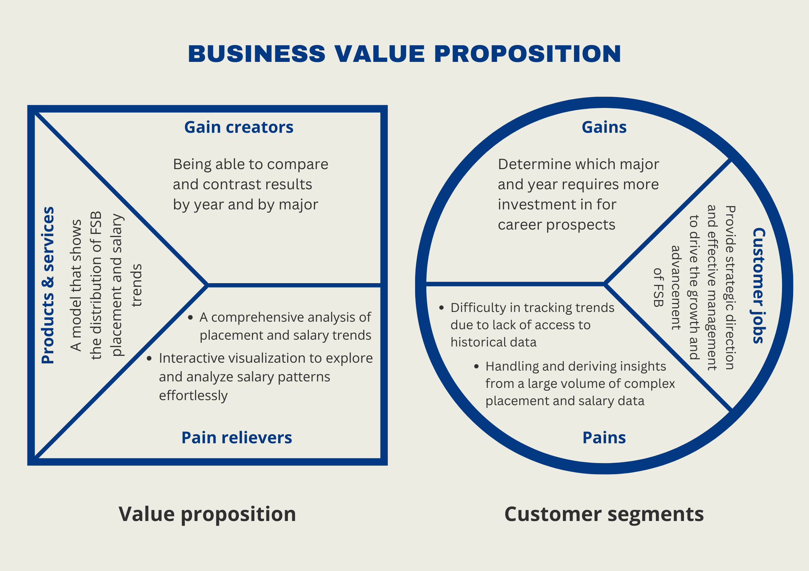

```{r setup, include=FALSE}
knitr::opts_chunk$set(echo = TRUE,message=FALSE,warning=FALSE)

# package initialization
rm(list = ls()) # clear global environment
graphics.off() # close all graphics
if(require(pacman)==FALSE) install.packages("pacman")
pacman::p_load(DataExplorer,tidyverse,readxl,zoo,stargazer,kableExtra,skimr,plotly,ggpubr,vtable,tm)
```

# Introduction and Purpose

This project will utilize FSB Placement Data to provide information on the macro placement and salary trends over the past three years, specifically whether our results are increasing, decreasing, or being steady for FSB as a whole and by major.

## Client Description

Our client for this analysis is Mr. Kirk Bogard, Associate Vice President for Development and External Relations in FSB.

## Business Value Proposition

The Business Value Proposition (BVP) below highlights the key value that our analysis will deliver to our client and contribute to the informed decision-making process regarding placements and salaries.



# Data Sources and Data Preprocessing

We will be using the FSB Survey Results from 2019 to 2021 as provided for our data analysis. The data preprocessing steps involve cleaning and standardizing the provided survey data to ensure consistency and accuracy in our analysis. The resulting dataset will be ready for comprehensive analysis.

## Read in the data

```{r}
data = readRDS(file = "FSB_BI_Survey_2019_2021.rds")
head(data)
```

## Overall Data Profile {.tabset}

The original dataset has 42 variables and 3235 observations with a comprehensive record of Farmer School of Business (FSB) students and their post-graduation experiences. It is important to note that the dataset contains some missing information which requires careful data preparation for subsequent analysis.

### Data Summary {.unnumbered}

```{r}
s <- skim(data)
summary(s)
```

### Character variables {.unnumbered}

```{r}
s %>% yank("character")
```

### Factor variables {.unnumbered}

```{r}
s %>% yank("factor")
```

### Numeric variables {.unnumbered}

```{r}
s %>% yank("numeric")
```

## Data Cleaning

```{r}
data <- data[,c(1,2,3,19,20,21,22,23,25,28,30,31,34,37,41,42)]
```

To conduct a meaningful analysis for your project, we select relevant variables from the dataset:

1.  `nmajor`: numeric,derived, the number of majors
2.  `major1`: text, OBIEE, first major
3.  `major2`: text, OBIEE, second major
4.  `minor1`: text, OBIEE, first listed minor
5.  `minor2`: text, OBIEE, second listed minor
6.  `IPEDS.Race.Ethnicity`: text, OBIEE, race/ethnicity
7.  `Gender`: text, OBIEE, sex
8.  `GPA.Range`: text, OBIEE, GPA within a .5 range
9.  `year.x`: text, derived, first four digits of Term.Code stored as a character variable
10. `survey_company`: text, survey, student reported company in which they accepted a job
11. `survey_gradprogram`: text, survey, student reported graduate program they will be attending
12. `survey_gradschool`: text, survey, stuent reported graduate school they will be attending
13. `survey_internships`: text, survey, Student reported number of internships they held during college
14. `survey_offers`: text, survey, student reported number of offers for full time employment received
15. `survey_salary`: numeric, survey, student reported salary
16. `survey_state`: text, survey, student reported state in which job is located

```{r}
# Clean the offer data
# unique(data$survey_offers)
data$survey_offers[is.na(data$survey_offers)] <- "N/A"
data$survey_offers[data$survey_offers == "na"] <- "N/A"

# Clean the internship data
# unique(data$survey_internships)
data$survey_internships[is.na(data$survey_internships)] <- "N/A"
data$survey_internships[data$survey_internships == "RPT"] <- "N/A" # do not know the meaning of RPT
```

One of the prominent challenges in the dataset is the variability in survey responses related to states and company names. These variations need to be standardized to facilitate accurate and consistent analysis.

### Standardizing State Data

```{r}
# head(unique(data$survey_state), 20)

# Convert to lowercase and remove white spaces
data$survey_state <- tolower(trimws(data$survey_state))
# Remove non-alphabetic characters
data$survey_state <- gsub("[^a-z]", "", data$survey_state)
# Remove 'usa', 'america', 'unitedstates', 'us', 'unitedstatesofamerica'
data$survey_state <- gsub("usa|america|unitedstates|us|unitedstatesofamerica", "", data$survey_state)

# Replace full state names with abbreviations
state_abb <- c(
  "al", "ak", "az", "ar", "ca", "co", "ct", "de", "fl", "ga", "hi", "id", "il", "in", "ia", "ks", "ky", 
  "la", "me", "md", "ma", "mi", "mn", "ms", "mo", "mt", "ne", "nv", "nh", "nj", "nm", "ny", "nc", "nd", 
  "oh", "ok", "or", "pa", "ri", "sc", "sd", "tn", "tx", "ut", "vt", "va", "wa", "wv", "wi", "wy", "dc"
)
state_full <- c(
  "alabama", "alaska", "arizona", "arkansas", "california", 
  "colorado", "connecticut", "delaware", "florida", "georgia", 
  "hawaii", "idaho", "illinois", "indiana", "iowa", "kansas", 
  "kentucky", "louisiana", "maine", "maryland", "massachusetts", 
  "michigan", "minnesota", "mississippi", "missouri", "montana", 
  "nebraska", "nevada", "newhampshire", "newjersey", "newmexico", 
  "newyork", "northcarolina", "northdakota", "ohio", "oklahoma", 
  "oregon", "pennsylvania", "rhodeisland", "southcarolina", 
  "southdakota", "tennessee", "texas", "utah", "vermont", 
  "virginia", "washington", "westvirginia", "wisconsin", "wyoming", 
  "districtofcolumbia"
)

# Create a mapping dictionary
state_mapping <- setNames(state_abb, state_full)

# Map state names using the mapping dictionary and convert to uppercase
data$survey_state <- ifelse(data$survey_state %in% state_full,
                            state_mapping[data$survey_state], 
                            data$survey_state)

# Convert to uppercase
data$survey_state <- toupper(data$survey_state)

# Adding fujianprovince and zhejiang province to china
data$survey_state[data$survey_state == "FUJIANPROVINCE" | data$survey_state == "ZHEJIANGPROVINCE"] <- "CHINA"

# Standardizing fields with misspells or alternative names
data$survey_state[data$survey_state == "MICHIGANDETROIT"] <- "MI"
data$survey_state[data$survey_state == "WASHINGTONDC"] <- "WA"
data$survey_state[data$survey_state == "OHIOTHE"] <- "OH"
data$survey_state[data$survey_state == "MASSACHETTS"] <- "MA"
data$survey_state[data$survey_state == "VIRGINIAVA"] <- "VA"

# Replacing blanks, na and miscellaneous values with "NOT AVAILABLE"
data$survey_state[is.na(data$survey_state)] <- "N/A"
data$survey_state[data$survey_state == ""] <- "N/A"
data$survey_state[data$survey_state == "NA"] <- "N/A"
data$survey_state[data$survey_state == "TBA" | data$survey_state == "TBD"] <- "N/A"

# unique(data$survey_state)
```

The data cleaning process for the survey_state data involves standardizing and preparing state names for analysis. Initially, all state names are converted to lowercase and any leading or trailing whitespaces are removed. Non-alphabetic characters and common variations of "USA" and "America" are removed. Full state names are replaced with their respective abbreviations using a mapping dictionary, ensuring consistency. The names are then converted to uppercase for uniformity. State names related to China are grouped appropriately. Misspelled or alternative state names are standardized. Blank, null, and miscellaneous values are replaced with "N/A" to indicate missing or invalid entries. This thorough cleaning ensures the state data is consistent and ready for further analysis or visualization.

After cleaning, the survey_state data is now significantly improved in terms of consistency and readiness for analysis or visualization. The cleaning process resulted in the following set of unique state values:

1.  40 U.S. States

2.  Remote locations

3.  Non-US locations: China, India, Montenegro, Belize, Ireland, Canada, United Kingdom, Turkey.

### Standardizing Company Data

```{r}
# head(unique(data$survey_company), 20)

# Replacing company names that have JP Morgan or some variations with JP Morgan Chase
data$survey_company[data$survey_company == "JP Morgan" | data$survey_company == "J.P Morgan" | data$survey_company == "J.P. Morgan" | data$survey_company == "J.P. Morgan U.S. Private Bank" | data$survey_company == "JP Morgan and Chase"  ] <- "JPMorgan Chase"
data$survey_company[data$survey_company == "JPMorgan Chase & Co."] <- "JPMorgan Chase" 
data$survey_company[data$survey_company == "JPMorgan Chase"] <- "JPMorgan Chase" 

# Replacing company names with alternative spelling name for EY
data$survey_company[data$survey_company == "Ernst & Young"] <- "EY"
data$survey_company[data$survey_company == "Ernst and Young"] <- "EY"

# Replacing company names with alternative spelling name for Textron
data$survey_company[data$survey_company == "Textron Aviation"] <- "Textron"
data$survey_company[data$survey_company == "Textron Systems"] <- "Textron"
data$survey_company[data$survey_company == "Textron Specialized Vehicles"] <- "Textron"

# Replacing company names with alternative spelling name for Coyote Logistics
data$survey_company[data$survey_company == "CoyoteLogisitcs"] <- "Coyote Logisitcs"
data$survey_company[data$survey_company == "Coyote"] <- "Coyote Logisitcs"

# Replacing company names with alternative spelling name for Deloitte
data$survey_company[data$survey_company == "Deloitte Consulting"] <- "Deloitte"
data$survey_company[data$survey_company == "Deloitte LLP"]	<- "Deloitte"		
data$survey_company[data$survey_company == "Deloitte Tax"]	<- "Deloitte"		
data$survey_company[data$survey_company == "Deloitte, China"] <- "Deloitte"

# Replacing company names with alternative spelling name for PNC
data$survey_company[data$survey_company == "PNC Bank"] <- "PNC"
data$survey_company[data$survey_company == "PNC Financial Services"] <- "PNC"

# Replacing company names with alternative spelling name for Grainger
data$survey_company[data$survey_company == "WW Grainger"] <- "W.W. Grainger"
data$survey_company[data$survey_company == "Grainger"] <- "W.W. Grainger"

# Replacing company names with alternative spelling name for Oracle
data$survey_company[data$survey_company == "Oracle Netsuite"] <- "Oracle"
data$survey_company[data$survey_company == "Oracle NetSuite"] <- "Oracle"
data$survey_company[data$survey_company == "Oracle - Netsuite"] <- "Oracle"

# Replacing other company names with alternative spelling name 
data$survey_company[data$survey_company ==  "PWC"] <- "PwC"
data$survey_company[data$survey_company == "Brown Gibbons Lang & Co."] <- "Brown Gibbons Lang & Company"
data$survey_company[data$survey_company == "Abercrombie & Fitch"] <- "Abercrombie"
data$survey_company[data$survey_company == "The Cincinnati Insurance Company"] <- "The Cincinnati Insurance Companies"
data$survey_company[data$survey_company == "Cincinnati Insurance"] <- "The Cincinnati Insurance Companies"
data$survey_company[data$survey_company == "Cincinnati Insurance Company"] <- "The Cincinnati Insurance Companies"
data$survey_company[data$survey_company == "Terillium"] <- "Terrilium"
data$survey_company[data$survey_company == "84.51"] <- "84.51º"
data$survey_company[data$survey_company == "Abbott Nutrition"] <- "Abbott"
data$survey_company[data$survey_company == "CIBC US"] <- "CIBC"
data$survey_company[data$survey_company == "Oppenheimer & Co. Inc."] <- "Oppenheimer & Co Inc."

# Replacing blanks, na and miscellaneous values with "NOT AVAILABLE"
data$survey_company[is.na(data$survey_company)] <- "N/A"
data$survey_company[data$survey_company == ""] <- "N/A"
data$survey_company[data$survey_company == "na"] <- "N/A"
data$survey_company[data$survey_company == "N/A"] <- "N/A"
data$survey_company[data$survey_company == "Not Yet"] <- "N/A"

# length(unique(data$survey_company))
# 881

# head(unique(data$survey_company), 20)
```

The data cleaning process for the `survey_company` section of the dataset involves normalizing company names and handling missing or null values. Various company name variations are replaced with the most frequently observed name to standardize the data. For example, alternative spellings of companies, such as "JP Morgan" and "Ernst & Young," are harmonized. Additionally, specific corrections are made for other companies to ensure consistency. Missing or null values in the survey_company column are replaced with "N/A" to signify missing or invalid entries.

After the cleaning process, the dataset now contains more consistent and standardized company names. Variations and discrepancies in company names have been addressed, and missing values have been replaced with "N/A" for consistency, ensuring that the data is prepared for further analysis.

### Handling Post-Graduation Plans

Students who have decided to pursue graduate programs after graduation may not have applied for jobs or internships, which could result in missing values for `survey_offers`, `survey_internships`, and `survey_company`. Thus, we want to evaluate the percentage of null or zero values at `survey_offers` and `survey_internships` as well as null values at `survey_company` for records with non-null values in either `survey_gradprogram` or `survey_gradschool`.

```{r}
# unique(data$survey_gradprogram)
data$survey_gradprogram[is.na(data$survey_gradprogram)] <- "N/A"
data$survey_gradprogram[data$survey_gradprogram == "N/a"] <- "N/A"

# unique(data$survey_gradschool)
data$survey_gradschool[is.na(data$survey_gradschool)] <- "N/A"
data$survey_gradschool[data$survey_gradschool == "N/a"] <- "N/A"

non_null_grad <- data %>%
  filter(survey_gradschool != "N/A" | survey_gradschool != "N/A")

non_null_grad %>% summarize(
  no_offers = mean(survey_offers == 'N/A' | survey_offers == 0),
  no_company = mean(survey_company == 'N/A'),
  no_intern = mean(survey_internships == 'N/A' | survey_internships == 0)
  )
```

```{r}
data <- data %>%
  filter(survey_gradprogram == 'N/A' & survey_gradschool == 'N/A') %>%
  select(-survey_gradprogram, -survey_gradschool)
```

The results show that the percentages of missing values or zeros in `survey_offers` and `survey_internships` and null values in `survey_company` are noticeable for the subset of students who have decided to pursue graduate programs after graduation. Given the significance of these percentages, we remove observations for students who have goals related to graduate school rather than internships or jobs, as our primary focus is on placement and salary trends.

## EDA of Cleaned Data File {.tabset}

### Data Summary {.unnumbered}

```{r}
# Exporting the cleaned data file
saveRDS(data, file = "cleaned_FSB_survey_data.RDS")

s <- skim(data)
summary(s)
```

### Character variables {.unnumbered}

```{r}
s %>% yank("character")
```

### Factor variables {.unnumbered}

```{r}
s %>% yank("factor")
```

### Numeric variables {.unnumbered}

```{r}
s %>% yank("numeric")
```

# FSB Placement Trends 2019-2021

## Fortune 1000 Companies

Firstly, to evaluate the company in which students reported they accepted a job, we integrated external data from the Fortune 1000 Companies (From 1996-2023) dataset from Kaggle. The data was scraped from the Fortune website. To determine if a company listed in our survey data is also a part of the Fortune 1000 for the corresponding year, we created a new column named `fortune` in our survey dataset. This column serves as a binary indicator with two values, "Yes" and "No".

```{r}
fortune1000 <- read_csv('kaggle-fortune500-1996-2023.csv')

# Create a new column to indicate if the company is in Fortune 1000 for the same year
data$fortune <- NA

# Iterate through each row in survey_data
for (i in 1:nrow(data)) {
  survey_company <- data$survey_company[i]
  survey_year <- data$year.x[i]

  # Filter the Fortune 1000 data for the same year
  fortune1000_subset <- fortune1000[fortune1000$year == survey_year, ]

  # Check if survey_company is included in any company name in the Fortune 1000 subset
  if (any(grepl(survey_company, fortune1000_subset$Name))) {
    data$fortune[i] <- "Yes"
  } else {
    data$fortune[i] <- "No"
  }
}
```

### Overall Trend {.tabset}

#### By Year {.unnumbered}

```{r}
data %>%
  group_by(year.x) %>%
  summarize(Count = sum(fortune == "Yes"),
            Percentage = round((Count / n()), 2)) %>%
  kable("html", escape = FALSE, caption = "Fortune 1000 Company Count and Percentage by Year")
```

The data illustrates a consistent trend in Fortune 1000 company placements from 2019 to 2021, with 150 placements (0.15%) in 2021 compared to 145 (0.14%) in 2019, indicating a relatively stable situation.

#### By Student Demographic {.unnumbered}

```{r}
data %>%
  group_by(Gender, IPEDS.Race.Ethnicity) %>%
  summarize(Company_Count = sum(fortune == "Yes")) %>%
  kable("html", escape = FALSE, caption = "Fortune 1000 Company Count by Student Demographic")
```

It's evident that the majority of placements are among White students, with 160 placements for females and 166 for males. Other demographic groups, such as Asian and Hispanic/Latino students, also secured notable placements, suggesting diversity in Fortune 1000 job opportunities.

### By Majors and Minors

For each student, their primary major (`major1`) and secondary major (`major2`) were collected, along with the year they graduated and whether they secured a job in a Fortune 1000 company. Note that observations where the secondary major was listed as "none" were omitted. Below is a comprehensive table that provides a summary of Fortune 1000 company counts and percentages based on students' majors and graduation years.

```{r}
# Create an empty data frame to store the data
major_fortune <- data.frame(major = character(0), fortune = character(0), year = character(0))

# Iterate through each row in the original dataset
for (i in 1:nrow(data)) {
  major1 <- data$major1[i]
  major2 <- data$major2[i]
  year <- data$year.x[i]
  fortune <- data$fortune[i]
  
  # Append major1 data to the new dataset
  major_fortune <- rbind(major_fortune, data.frame(major = major1, fortune = fortune, year = year))
  
  # Ignore observations where major2 is "none"
  if (major2 != "none") {
      # Append the data to the new dataset
      major_fortune <- rbind(major_fortune, data.frame(major = major2, fortune = fortune, year = year))
  }
}

major_fortune %>%
  group_by(major, year) %>%
  summarize(
    Count = sum(fortune == "Yes"),
    Percentage = round((Count / n()), 2)) %>%
  kable("html", escape = FALSE, caption = "Fortune 1000 Company Count and Percentage by Major")
```

The above summary reveals several noteworthy trends:

-   **Accountancy**: This major had a significant increase in both count and percentage from 2019 to 2021, making it one of the notable success stories. In 2019, 5 graduates (0.03%) secured Fortune 1000 positions, which increased to 14 graduates (0.09%) in 2021.

-   **Finance**: Finance majors consistently maintained a strong presence in Fortune 1000 companies throughout the three years. The count remained relatively high, with 60 graduates (0.17%) in 2019, 45 graduates (0.12%) in 2020, and 45 graduates (0.14%) in 2021.

-   **Human Capital Management & Leadership**: This major exhibited remarkable growth, with a significant increase in the percentage of graduates securing Fortune 1000 positions. In 2020, 1 graduate (0.06%) joined such companies, while the percentage surged to 15 graduates (0.28%) in 2021, indicating the potential and demand for this field.

-   **Business Analytics**: While the overall numbers are relatively low, the percentage of graduates securing Fortune 1000 positions increased from 2019 (0.14%) to 2021 (0.13%).

-   **Marketing**: Marketing had a consistent presence, with percentages increasing slightly over the three years, making it a promising major for Fortune 1000 job placements.

-   **Business Economics**: Though the percentage declined from 2019 (0.17%) to 2021 (0.05%), Business Economics graduates still accounted for a substantial number of placements.

## Job Offers and Internships

### Overall

```{r}
data %>%
  group_by(year.x) %>%
  summarize(
    Count_Intern = sum(survey_internships != "N/A" & survey_internships != "0"),
    Count_Offer = sum(survey_offers != "N/A" & survey_offers != "0")
  ) %>%
  kable("html", escape = FALSE, caption = "Number of Students with Internships and Job Offers by Year")
```

The table illustrates a trend over the years regarding the number of students at FSB who reported having internships and job offers. It shows an overall increase in both categories from 2019 to 2021, with the highest counts of students having internships and job offers in 2021. This suggests a positive trend in student internship and job placement rates over this three-year period.

### By Majors and Minors

Firstly, we observed that "3" has the highest count among responses with more than 2 offers in our dataset, so in order to maintain consistency and simplify the analysis, we decided to replace "2+" and "multiple" with "3" to reflect the most common scenario in the data. Secondly, we created a new column 'nminor' to count the number of minors for each student. Then we summarize the results to provide insights into how the number of majors and minors may influence students' internship and job offers.

```{r}
data <- data %>%
  mutate(survey_offers = ifelse(survey_offers %in% c("2+", "multiple"), "3", survey_offers))

data$nminor <- ifelse(data$minor1 != "No Minor" & data$minor2 != "No Minor", 2,
                      ifelse(data$minor1 != "No Minor" | data$minor2 != "No Minor", 1, 0))
data$nminor <- as.integer(data$nminor)

# data %>% summarize(null_intern = mean(survey_internships == "N/A"), null_offer = mean(survey_offers == "N/A"))

data1 = data %>%
  mutate(survey_internships = as.numeric(survey_internships)) %>%
  mutate(survey_offers = as.numeric(survey_offers)) %>%
  drop_na()

data1 %>%
  group_by(nmajor, nminor) %>%
  summarize(
    Count = n(),
    Mean_Intern = mean(survey_internships),
    Median_Intern = median(survey_internships),
    Mean_Offers = mean(survey_offers),
    Median_Offers = median(survey_offers)
)
```

The result above shows that having one or two majors appears to have a more noticeable impact on the number of internships compared to the number of minors. However, the difference in means is not substantial, suggesting that the choice of majors and minors may not be the sole determining factor in the number of internships and job offers. Other factors, such as individual skills, networking, and job market conditions, may also play a significant role in students' career opportunities.

```{r}
# Create an empty data frame to store the data
major_offer <- data.frame(major = character(0), internships = numeric(0), offers = numeric(0), year = character(0))

# Iterate through each row in the original dataset
for (i in 1:nrow(data1)) {
  major1 <- data1$major1[i]
  major2 <- data1$major2[i]
  internship <- data1$survey_internships[i]
  offer <- data1$survey_offers[i]
  year <- data1$year.x[i]
  
  # Major 1
  major_offer <- rbind(major_offer, data.frame(major = major1, internships = internship, offers = offer, year = year))
  
  # Major 2
  if (major2 != "none") {
      major_offer <- rbind(major_offer, data.frame(major = major2, internships = internship, offers = offer, year = year))
  }
}

major_offer %>%
  group_by(major, year) %>%
  summarize(
    Mean_Intern = mean(internships),
    Median_Intern = median(internships),
    Mean_Offers = mean(offers),
    Median_Offers = median(offers))
```

The table above summarizes the mean and median numbers of internships and job offers by major and year to provides insights into the internship and job offer outcomes of FSB students over the year 2019-2021. It appears that the major **Business Analytics** performs well in terms of internships and job offers. In 2019, students majoring in Business Analytics had the highest average number of internships (2.50) among all the majors. Additionally, they maintained a relatively high average number of job offers over the years. **Finance** is another major that consistently performs well in terms of job offers, with an average number of offers above 1.80 in all years.

### By GPA Ranges

The table below illustrates that students in the "3.00 - 3.49" and "3.50 - 4.00" GPA ranges have the highest number of internships and job offers, suggesting a potential positive correlation between higher GPAs and securing these opportunities. However, it's important to note that there are exceptions, as some students with lower GPAs also reported having internships and job offers.

```{r}
data %>%
  group_by(GPA.Range) %>%
  summarize(
    Count_Intern = sum(survey_internships != "N/A" & survey_internships != "0"),
    Count_Offer = sum(survey_offers != "N/A" & survey_offers != "0")
  ) %>%
  kable("html", escape = FALSE, caption = "Number of Students with Internships and Job Offers by Year")
```

We would like to see how FSB students perform academically over the years 2019-2021 in terms of their GPA. From the table below, in 2019 and 2020, a significant proportion of FSB students had moderate GPAs in the "3.00 - 3.49" range, with a smaller percentage achieving higher GPAs. In 2021, there is a shift with fewer students in the "3.00 - 3.49" range and a slight increase in students achieving higher GPAs in the "3.50 - 4.00" range. This could indicate potential changes in academic performance within the FSB student population over the years.

```{r}
data %>%
  group_by(year.x) %>%
  summarize(Count_3.0 = round(sum(GPA.Range == "3.00 - 3.49")/n(), 2),
            Count_3.5 = round(sum(GPA.Range == "3.50 - 4.00")/n(), 2))
```

## Salary

### Overall

```{r}
data2 = data %>%
  drop_na(survey_salary)

data2 %>% count(survey_salary, sort = TRUE)

summary(data2$survey_salary)
```

Salary of survey respondents ranges from \$10,000 to \$175,000, with a mean value of \$58,130 and a median value of \$58,000. The most frequent salary amount that can be observed is \$60,000, followed by \$55,000 and \$65,000. This is just the general overview of the `survey_salary` field, and we will take a deeper dive in terms of major and minor concentration, as well as job locations.

### By Year

```{r}
data2 %>% group_by(year.x) %>% summarize(mean = mean(survey_salary))
```

The data shows some variation in the average salary of FSB students over the years 2019-2021. While there was an increase from 2019 to 2020, there was a slight decrease in 2021. These changes in average salary may be influenced by various factors such as job market conditions, economic trends, and individual career choices among FSB graduates during those years.

### By Majors and Minors

```{r}
# Create an empty data frame to store the data
major_salary <- data.frame(major = character(0), salary = numeric(0), year = character(0))

# Iterate through each row in the original dataset
for (i in 1:nrow(data1)) {
  major1 <- data1$major1[i]
  major2 <- data1$major2[i]
  salary <- data1$survey_salary[i]
  year <- data1$year.x[i]
  
  # Major 1
  major_salary <- rbind(major_salary, data.frame(major = major1, salary = salary, year = year))
  
  # Major 2
  if (major2 != "none") {
      major_salary <- rbind(major_salary, data.frame(major = major2, salary = salary, year = year))
  }
}

major_salary %>%
  group_by(major) %>%
  summarize(mean = mean(salary), median = median(salary)) %>%
  arrange(desc(mean))
```

From the table above, we see that Business Analytics and Information Systems majors tend to have the highest salaries on average, followed closely by Business Economics and Finance, while Marketing majors have the lowest mean salary. Therefore, the choice of major has potential influence on the salary after graduation, and this summary can help students and educators understand the potential salary outcomes associated with different majors within FSB.

### By Job Locations {.tabset}

#### U.S. States {.unnumbered}

```{r}
data2 %>%
  filter(!(survey_state %in% c("N/A", "REMOTE", "CHINA", "INDIA", "BELIZE", "IRELAND", "UNITEDKINGDOM", "TURKEY"))) %>%
  group_by(survey_state) %>%
  summarise(avg_salary = mean(survey_salary)) %>%
  arrange(desc(avg_salary))
```

The table shows the average salary by job locations in the U.S.. The highest reported average salary is \$175,000 in Montana (MT), but this value is based on a single observation and may not be indicative of the broader employment landscape in the state. Additionally, there are other states having average salaries above \$65,000, namely Washington, Utah, Louisiana, Maryland, California, New York, and Virginia, indicating that jobs in these regions may offer more competitive compensation compared to other states.

#### Remote vs. On-site {.unnumbered}

We realized that only the survey responses for job offers in the year 2021 include job locations categorized as 'REMOTE,' while there were no recorded responses indicating remote job locations in the years 2019 and 2020.

```{r}
data2 <- data2 %>%
  filter(survey_state != "N/A") %>%
  mutate(job_location = ifelse(survey_state == "REMOTE", "Remote", "Onsite"))

data2 %>% group_by(year.x, job_location) %>% summarize(count = n())
```

The comparison table below indicates that onsite job positions tend to have a slightly higher average salary compared to remote positions. However, it's important to note that the sample size of the survey responses for remote jobs is limited, which may impact the accuracy of this comparison.

```{r}
data2 %>% filter(year.x == "2021") %>% 
  group_by(job_location) %>% 
  summarize(avg_salary = mean(survey_salary))
```

#### U.S. vs. Non-U.S. {.unnumbered}

The table below indicates that, on average, job positions within the U.S. tend to have higher salaries compared to those outside the U.S. The year 2020 witnessed a significant discrepancy in salary between the two categories, with U.S. salaries being substantially higher. It's important to note that several factors, including job location, cost of living, and the job market, can influence these differences in average salaries.

```{r}
data2 <- data2 %>%
  mutate(job_country = ifelse(survey_state %in% c("CHINA", "INDIA", "BELIZE", "IRELAND", "UNITEDKINGDOM", "TURKEY"),
"Non U.S.", "U.S."))

# Exporting the data file
saveRDS(data2, file = "Job_Location_data.RDS")

data2 %>%
  group_by(year.x, job_country) %>% 
  summarize(avg_salary = mean(survey_salary))
```

# Conclusions and Recommedations

1. **Placement Trends:** 

- Our analysis reveals that FSB's placement results have shown stability over the past three years. The percentage of students securing jobs or job offers has remained consistent, indicating that FSB's placement efforts have been effective in maintaining steady placement rates. To continue this success, we recommend ongoing investments in career development resources and strengthening relationships with industry partners.

2. **Salary Trends:**

- In terms of salary trends, we observed variations over the years. Salaries for FSB graduates have remained relatively stable, with minor fluctuations. The year 2020 saw a peak in average salaries, while 2021 witnessed a slight decrease. Overall, FSB graduates continue to enjoy competitive salaries.

- While salary trends have been generally stable, addressing the slight fluctuations seen in 2020 and 2021 could be beneficial. To achieve this, FSB can focus on assisting students in negotiation skills and encouraging participation in high-demand industries or job markets.

3. **Major-Specific Analysis:** 

- Examining placement and salary trends on a major-specific level provides insights into the performance of various academic programs. Major-specific trends indicate that certain majors consistently outperform others in terms of both placement and salary, such as Business Analytics, Information Systems, and Finance. 

- To improve outcomes for programs with lower placement and salary rates, FSB should consider tailored interventions such as industry partnerships, networking opportunities, and internship programs. Emulating successful strategies from higher-performing programs can help elevate the overall performance of FSB's graduates. This analysis enables FSB to tailor its strategies and investments to further strengthen underperforming programs while maintaining the strengths of successful ones.

# References

1. [Kaggle Dataset: Fortune 1000 Companies (From 1996)](https://www.kaggle.com/datasets/garrethlee/fortune-500-companies-dataset)

# Our Computing Environment

```{r}
sessionInfo()
```

**R Packages:** DataExplorer, tidyverse, readxl, zoo, stargazer, kableExtra, skimr, plotly, ggpubr, vtable, and tm.

**Version Control:**  
- We used Git and hosted our project on GitHub. The repository can be accessed at [Project Repository](https://github.com/linhvu115/ISA616-Project2-Group9).

**Reproducibility:**  
- We organized our project using R projects for better reproducibility and sharing. We also included a comprehensive README file with a list of the files within our project folder as well as the instructions to run files in a certain order.
