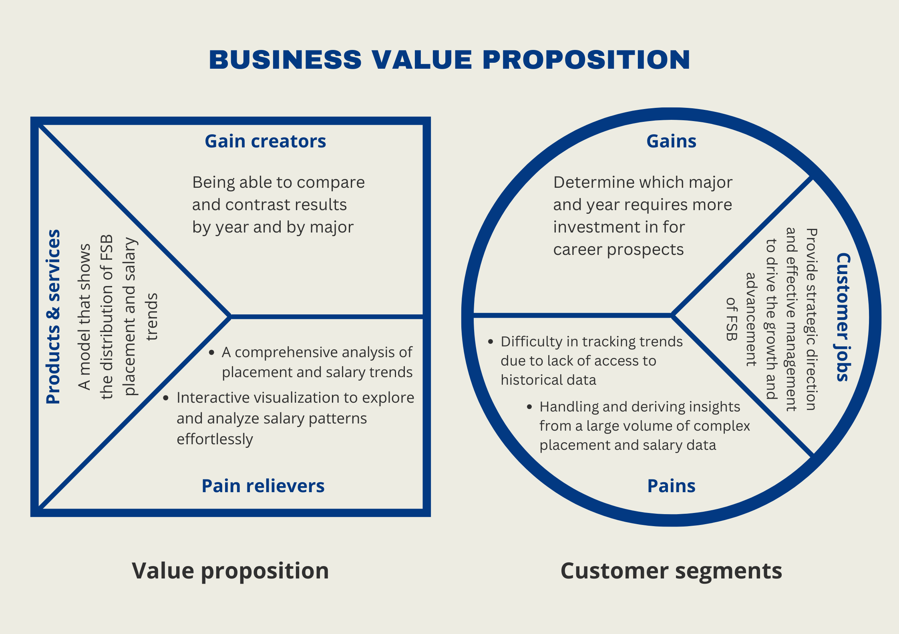

```{r setup, include=FALSE}
knitr::opts_chunk$set(echo = TRUE,message=FALSE,warning=FALSE)

#package initialization
rm(list = ls()) # clear global environment
graphics.off() # close all graphics
if(require(pacman)==FALSE) install.packages("pacman")
pacman::p_load(DataExplorer,tidyverse,readxl,zoo,stargazer,kableExtra,skimr,plotly,ggpubr,vtable,tm)
```

# Introduction and Purpose

This project will utilize FSB Placement Data to provide information on the macro placement and salary trends over the past three years, specifically whether our results are increasing, decreasing, or being steady for FSB as a whole and by major.

## Client Description

Our client for this analysis is Mr. Kirk Bogard, Associate Vice President for Development and External Relations in FSB.

## Business Value Proposition



The Business Value Proposition (BVP) image above highlights the key value that our analysis will deliver to our client and contribute to the informed decision-making process regarding placements and salaries.

# Data Sources and Data Preprocessing

We will be using the FSB Survey Results from 2019 to 2021 as provided for our data analysis. The data preprocessing steps involve cleaning and standardizing the provided survey data to ensure consistency and accuracy in our analysis. The resulting dataset will be ready for comprehensive analysis.

## Read in the data

```{r}
data = readRDS(file = "FSB_BI_Survey_2019_2021.rds")

head(data)
```

## Overall Data Profile

```{r}
skim(data)
```

## EDA using DataExplorer Package

```{r}
introduce(data)
plot_intro(data)
plot_missing(data)

# Distributions
plot_bar(data)
plot_histogram(data)

# Correlations
plot_correlation(data)
```

### Data Cleaning

### Clean the STATE data

```{r}
# Convert to lowercase and remove white spaces
data$survey_state <- tolower(trimws(data$survey_state))
# Remove non-alphabetic characters
data$survey_state <- gsub("[^a-z]", "", data$survey_state)
# Remove 'usa', 'america', 'unitedstates', 'us', 'unitedstatesofamerica'
data$survey_state <- gsub("usa|america|unitedstates|us|unitedstatesofamerica", "", data$survey_state)

# Replace full state names with abbreviations
state_abb <- c(
  "al", "ak", "az", "ar", "ca", "co", "ct", "de", "fl", "ga", "hi", "id", "il", "in", "ia", "ks", "ky", 
  "la", "me", "md", "ma", "mi", "mn", "ms", "mo", "mt", "ne", "nv", "nh", "nj", "nm", "ny", "nc", "nd", 
  "oh", "ok", "or", "pa", "ri", "sc", "sd", "tn", "tx", "ut", "vt", "va", "wa", "wv", "wi", "wy", "dc"
)
state_full <- c(
  "alabama", "alaska", "arizona", "arkansas", "california", 
  "colorado", "connecticut", "delaware", "florida", "georgia", 
  "hawaii", "idaho", "illinois", "indiana", "iowa", "kansas", 
  "kentucky", "louisiana", "maine", "maryland", "massachusetts", 
  "michigan", "minnesota", "mississippi", "missouri", "montana", 
  "nebraska", "nevada", "newhampshire", "newjersey", "newmexico", 
  "newyork", "northcarolina", "northdakota", "ohio", "oklahoma", 
  "oregon", "pennsylvania", "rhodeisland", "southcarolina", 
  "southdakota", "tennessee", "texas", "utah", "vermont", 
  "virginia", "washington", "westvirginia", "wisconsin", "wyoming", 
  "districtofcolumbia"
)

# Create a mapping dictionary
state_mapping <- setNames(state_abb, state_full)

# Map state names using the mapping dictionary and convert to uppercase
data$survey_state <- ifelse(data$survey_state %in% state_full,
                            state_mapping[data$survey_state], 
                            data$survey_state)

# Convert to uppercase
data$survey_state <- toupper(data$survey_state)

# Adding fujianprovince and zhejiang province to china
data$survey_state[data$survey_state == "FUJIANPROVINCE" | data$survey_state == "ZHEJIANGPROVINCE"] <- "CHINA"

# Standardizing fields with misspells or alternative names
data$survey_state[data$survey_state == "MICHIGANDETROIT"] <- "MI"
data$survey_state[data$survey_state == "WASHINGTONDC"] <- "WA"
data$survey_state[data$survey_state == "OHIOTHE"] <- "OH"
data$survey_state[data$survey_state == "MASSACHETTS"] <- "MA"
data$survey_state[data$survey_state == "VIRGINIAVA"] <- "VA"

# Replacing blanks, na and miscellaneous values with "NOT AVAILABLE"
data$survey_state[is.na(data$survey_state)] <- "NOT AVAILABLE"
data$survey_state[data$survey_state == ""] <- "NOT AVAILABLE"
data$survey_state[data$survey_state == "TBA" | data$survey_state == "TBD"] <- "NOT AVAILABLE"
```

The data cleaning process for the survey_state data involves standardizing and preparing state names for analysis. Initially, all state names are converted to lowercase and any leading or trailing whitespaces are removed. Non-alphabetic characters and common variations of "USA" and "America" are removed. Full state names are replaced with their respective abbreviations using a mapping dictionary, ensuring consistency. The names are then converted to uppercase for uniformity. State names related to China are grouped appropriately. Misspelled or alternative state names are standardized. Blank, NA, and miscellaneous values are replaced with "NOT AVAILABLE" to indicate missing or invalid entries. This thorough cleaning ensures the state data is consistent and ready for further analysis or visualization.

### Clean the survey_company field

```{r}
# Replacing company names that have JP Morgan or some variations with JP Morgan Chase
data$survey_company[data$survey_company == "JP Morgan" | data$survey_company == "J.P Morgan" | data$survey_company == "J.P. Morgan" | data$survey_company == "J.P. Morgan U.S. Private Bank" | data$survey_company == "JP Morgan and Chase"  ] <- "JP Morgan Chase"
data$survey_company[data$survey_company == "JPMorgan Chase & Co."] <- "JP Morgan Chase" 
data$survey_company[data$survey_company == "JPMorgan Chase"] <- "JP Morgan Chase" 

# Replacing company names with alternative spelling name for EY
data$survey_company[data$survey_company == "Ernst & Young"] <- "EY"
data$survey_company[data$survey_company == "Ernst and Young"] <- "EY"

# Replacing company names with alternative spelling name for Textron
data$survey_company[data$survey_company == "Textron Aviation"] <- "Textron"
data$survey_company[data$survey_company == "Textron Systems"] <- "Textron"
data$survey_company[data$survey_company == "Textron Specialized Vehicles"] <- "Textron"

# Replacing company names with alternative spelling name for Coyote Logistics
data$survey_company[data$survey_company == "CoyoteLogisitcs"] <- "Coyote Logisitcs"
data$survey_company[data$survey_company == "Coyote"] <- "Coyote Logisitcs"

# Replacing company names with alternative spelling name for Deloitte
data$survey_company[data$survey_company == "Deloitte Consulting"] <- "Deloitte"
data$survey_company[data$survey_company == "Deloitte LLP"]	<- "Deloitte"		
data$survey_company[data$survey_company == "Deloitte Tax"]	<- "Deloitte"		
data$survey_company[data$survey_company == "Deloitte, China"] <- "Deloitte"

# Replacing company names with alternative spelling name for PNC
data$survey_company[data$survey_company == "PNC Bank"] <- "PNC"
data$survey_company[data$survey_company == "PNC Financial Services"] <- "PNC"

# Replacing company names with alternative spelling name for Grainger
data$survey_company[data$survey_company == "WW Grainger"] <- "W.W. Grainger"
data$survey_company[data$survey_company == "Grainger"] <- "W.W. Grainger"

# Replacing company names with alternative spelling name for Oracle
data$survey_company[data$survey_company == "Oracle Netsuite"] <- "Oracle"
data$survey_company[data$survey_company == "Oracle NetSuite"] <- "Oracle"
data$survey_company[data$survey_company == "Oracle - Netsuite"] <- "Oracle"

# Replacing other company names with alternative spelling name 
data$survey_company[data$survey_company ==  "PWC"] <- "PwC"
data$survey_company[data$survey_company == "Brown Gibbons Lang & Co."] <- "Brown Gibbons Lang & Company"
data$survey_company[data$survey_company == "Abercrombie & Fitch"] <- "Abercrombie"
data$survey_company[data$survey_company == "The Cincinnati Insurance Company"] <- "The Cincinnati Insurance Companies"
data$survey_company[data$survey_company == "Cincinnati Insurance"] <- "The Cincinnati Insurance Companies"
data$survey_company[data$survey_company == "Cincinnati Insurance Company"] <- "The Cincinnati Insurance Companies"
data$survey_company[data$survey_company == "Terillium"] <- "Terrilium"
data$survey_company[data$survey_company == "84.51"] <- "84.51º"
data$survey_company[data$survey_company == "Abbott Nutrition"] <- "Abbott"
data$survey_company[data$survey_company == "CIBC US"] <- "CIBC"
data$survey_company[data$survey_company == "Oppenheimer & Co. Inc."] <- "Oppenheimer & Co Inc."

# Replacing blanks, na and miscellaneous values with "NOT AVAILABLE"
data$survey_company[is.na(data$survey_company)] <- "NOT AVAILABLE"
data$survey_company[data$survey_company == ""] <- "NOT AVAILABLE"
data$survey_company[data$survey_company == "na"] <- "NOT AVAILABLE"
data$survey_company[data$survey_company == "N/A"] <- "NOT AVAILABLE"
data$survey_company[data$survey_company == "Not Yet"] <- "NOT AVAILABLE"

# Making all letters capital in a string
data$survey_company <- str_to_upper(data$survey_company)
```

This portion of the code is cleaning the survey_company section of the data. There are many company names that are misspelled or have additional symbols in their names, so we are trying to normalize all the different names under the one most frequently observed. Additionally, we also replaced na and blank values with "NOT AVAILABLE".

# Our Computing Environment

Our RStudio Version: 

RStudio 2023.09.0+463 "Desert Sunflower" Release (b51c81cc303d4b52b010767e5b30438beb904641, 2023-09-25) for windows
Mozilla/5.0 (Windows NT 10.0; Win64; x64) AppleWebKit/537.36 (KHTML, like Gecko) RStudio/2023.09.0+463 Chrome/114.0.5735.289 Electron/25.5.0 Safari/537.36

Additionally, we are using the packages DataExplorer,tidyverse,readxl,zoo,stargazer,kableExtra,skimr,plotly,ggpubr,vtable and tm.


